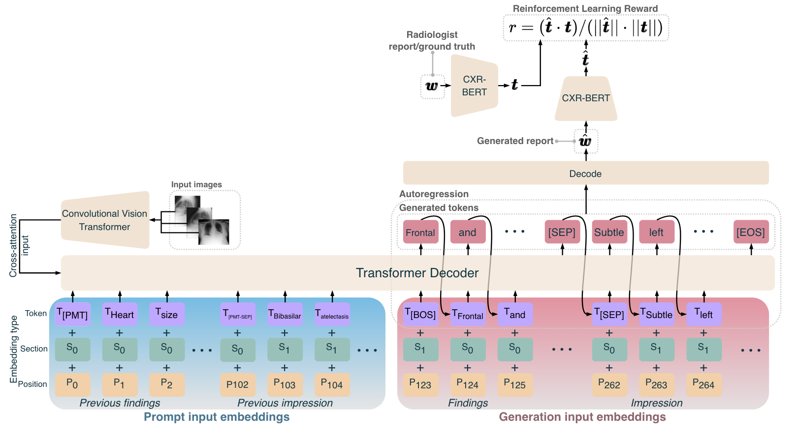

# CXRMate: Leveraging Longitudinal Data and a Semantic Similarity Reward for Chest X-Ray Report Generation

Paper (arXiv): https://arxiv.org/abs/2307.09758
```
@misc{nicolson2023longitudinal,
      title={Longitudinal Data and a Semantic Similarity Reward for Chest X-Ray Report Generation}, 
      author={Aaron Nicolson and Jason Dowling and Bevan Koopman},
      year={2023},
      eprint={2307.09758},
      archivePrefix={arXiv},
      primaryClass={cs.CV}
}
```

CXRMate is a longitudinal, variable CXR report generation encoder-to-decoder model that conditions the report generation process on the report from the previous patient's study if available. The CXRMate checkpoint trained on MIMIC-CXR is available on the Hugging Face Hub: https://huggingface.co/aehrc/cxrmate.

<!-- ADD CITATION HERE -->

||
|----|
| <p align="center"> <a>CXRMate: longitudinal, variable-CXR report generation. The decoder is prompted by the report of the previous study. [PMT], [PMT-SEP] [BOS],  [SEP], and [EOS] denote the *prompt*, *prompt separator*,  *beginning-of-sentence*, *separator*, and *end-of-sentence* special tokens, respectively.</a> </p> |

# Generated reports:
<!-- Generated reports for the single-CXR, variable-CXR, and longitudinal, variable-CXR (both prompted with the ground truth and the generated reports) are located in the [`generated_reports`](https://github.com/aehrc/cxrmate/blob/main/generated_reports) directory. -->
Generated reports for the single-CXR, variable-CXR, and longitudinal, variable-CXR (both prompted with the ground truth and the generated reports) are located in the [`generated_reports`](https://anonymous.4open.science/r/cxrmate-D1D3/generated_reports) directory.

# Hugging Face models:

 - **Longitudinal, variable-CXR report generation** with SCST & CXR-BERT reward and generated previous reports: https://huggingface.co/aehrc/cxrmate
 - **Longitudinal, variable-CXR report generation** with SCST & CXR-BERT reward and ground truth previous reports: https://huggingface.co/aehrc/cxrmate-gt
 - **Longitudinal, variable-CXR report generation** with TF: https://huggingface.co/aehrc/cxrmate-tf
 - **Variable-CXR report generation** with TF: https://huggingface.co/aehrc/cxrmate-variable-tf
 - **Single-CXR report generation** with TF: https://huggingface.co/aehrc/cxrmate-single-tf

***SCST: Self-Critical Sequence Training, TF: Teacher Forcing***

# Notebook examples:

Notebook examples for the models can be found in the [`examples`](https://anonymous.4open.science/r/cxrmate-D1D3/examples) directory.

# Dataset:

 - The MIMIC-CXR-JPG dataset is available at: 
        ```
        https://physionet.org/content/mimic-cxr-jpg/2.0.0/
        ```

# Installation:
After cloning the repository, install the required packages in a virtual environment.
The required packages are located in `requirements.txt`:
```shell script
python -m venv --system-site-packages venv
source venv/bin/activate
python -m pip install --upgrade pip
python -m pip install --upgrade -r requirements.txt --no-cache-dir
```

# Test the Hugging Face checkpoints:   

The model configurations for each task can be found in its `config` directory, e.g. `config/test_huggingface_longitudinal_gen_prompt_cxr-bert.yaml`. To run testing:

```shell
dlhpcstarter -t cxrmate_hf -c config/test_huggingface/longitudinal_gen_prompt_cxr-bert.yaml --stages_module tools.stages --test
```

See [`dlhpcstarter==0.1.4`](https://github.com/csiro-mlai/dl_hpc_starter_pack) for more options. 

Note: data will be saved in the experiment directory (`exp_dir` in the configuration file).

# Training:
   
To train with teacher forcing:
 
```
dlhpcstarter -t cxrmate -c config/train/longitudinal_gt_prompt_tf.yaml --stages_module tools.stages --train
```

The model can then be tested with the `--test` flag:

```
dlhpcstarter -t cxrmate -c config/train/longitudinal_gt_prompt_tf.yaml --stages_module tools.stages --test
```

To then train with Self-Critical Sequence Training (SCST) with the CXR-BERT reward:

 1. Copy the path to the checkpoint from the `exp_dir` for the configuration above, then paste it in the configuration for SCST as `warm_start_ckpt_path`, then:
 2. 
    ```
    dlhpcstarter -t mimic_cxr -c config/train/longitudinal_gen_prompt_cxr-bert.yaml --stages_module tools.stages --train
    ```

See [`dlhpcstarter==0.1.4`](https://github.com/csiro-mlai/dl_hpc_starter_pack) for more options. 

# Help/Issues:
If you need help, or if there are any issues, please leave an issue and we will get back to you as soon as possible.


